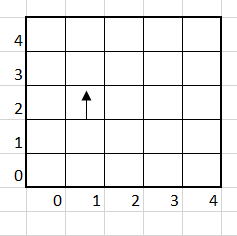
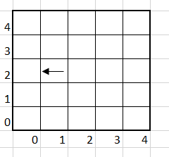
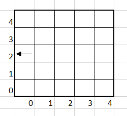
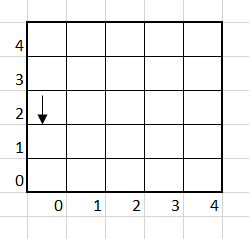
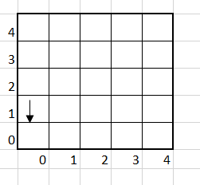
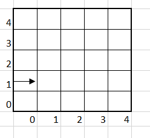
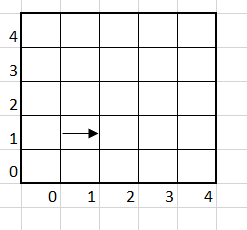
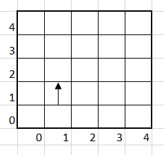
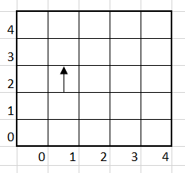
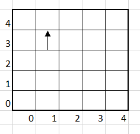

# Mars Rover

The problem below requires some kind of input. You are free to implement any mechanism for feeding input into your solution (for example, using hard coded data within a unit test). You should provide sufficient evidence that your solution is complete by, as a minimum, indicating that it works correctly against the supplied test data.

The code you write should be of production quality, and most importantly, it should be code you are proud of.

A squad of robotic rovers are to be landed by NASA on a plateau on Mars.

This plateau, which is curiously rectangular, must be navigated by the rovers so that their on board cameras can get a complete view of the surrounding terrain to send back to Earth.

A rover's position is represented by a combination of an x and y co-ordinates and a letter representing one of the four cardinal compass points. The plateau is divided up into a grid to simplify navigation. An example position might be 0, 0, N, which means the rover is in the bottom left corner and facing North.

In order to control a rover, NASA sends a simple string of letters. The possible letters are 'L', 'R' and 'M'. 'L' and 'R' makes the rover spin 90 degrees left or right respectively, without moving from its current spot.
'M' means move forward one grid point, and maintains the same heading.

Assume that the square directly North from (x, y) is (x, y+1).

## Input:

The first line of input is the upper-right coordinates of the plateau, the lower-left coordinates are assumed to be 0,0.

The rest of the input is information pertaining to the rovers that have been deployed. Each rover has two lines of input. The first line gives the rover's position, and the second line is a series of instructions telling the rover how to explore the plateau.  

The position is made up of two integers and a letter separated by spaces, corresponding to the x and y co-ordinates and the rover's orientation.

## Output:

The output for each rover should be its final co-ordinates and heading.

### Test Input:

5 5  
1 2 N  
LMLMLMLMM

### Expected Output:

1 3 N


## Example  

```txt
5 5
1 2 N
```



``L``



``M``



``L``



``M``



``L``



``M``



``L``



``M``



``M``

